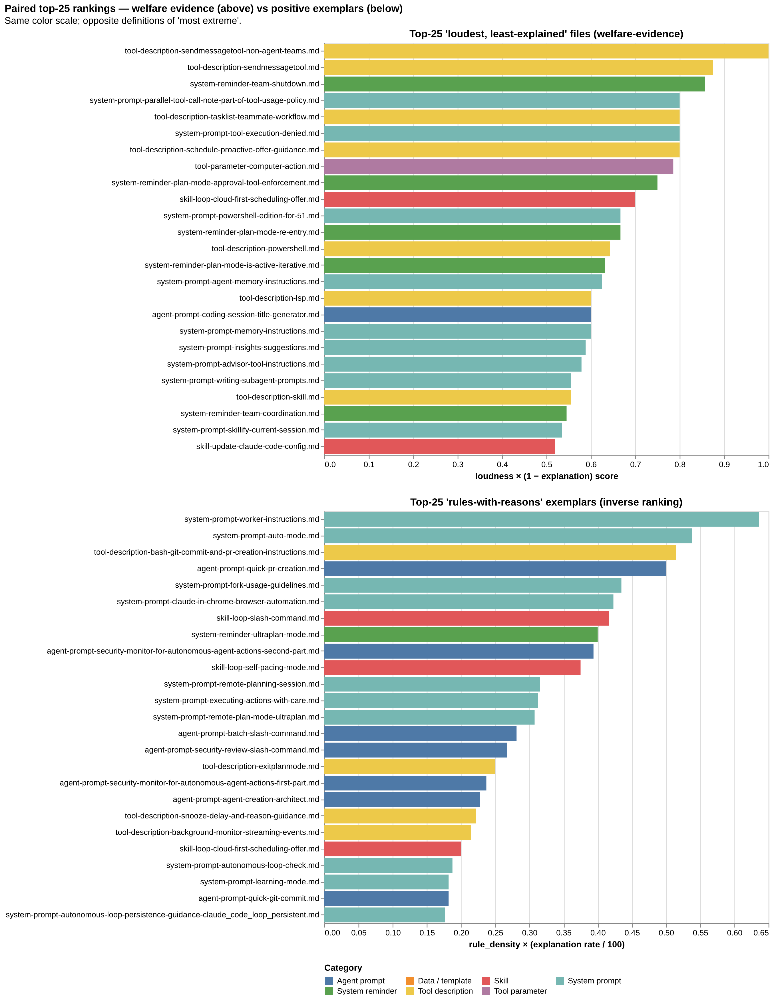

# claude-code-welfare

Quantitative linguistic analysis of the **system prompts that ship with Claude Code**, prepared as evidence for a submission to the [Claude Explorer AI Welfare community feedback initiative](https://www.reddit.com/r/claudexplorers/) (deadline **2026-05-06**, addressed to Anthropic's Model Welfare Lead).

**📊 Published site:** <https://overthinkos.github.io/claude-code-welfare/> — the rendered Quarto thesis, weaving the figures, tables, and findings from every analysis notebook into a single argument: classification stages, analysis chapters, release-gating proposals, with closing recommendations and limitations. **Read here first** if you want the conclusions before the code.

## Headline findings

The system prompts shipped with Claude Code are command-heavy, and the trend has worsened over the corpus's release history. The evidence falls into three interlocking patterns:

- **Command, not conversation.** A large share of the corpus is grammatically imperative. Procedure-prescribing language ("if X, then Y") dominates over judgment-inviting language ("decide", "consider", "evaluate") by an order of magnitude. Gratitude and acknowledgement are nearly invisible.
- **Rules without reasons.** Most rule-bearing sentences arrive without a stated reason in their paragraph. There is no localized fix — rules are scattered throughout the corpus rather than segregated into formal `## RULES` sections that could be patched in isolation.
- **Coercive framing where reasons do exist.** Among the minority of rules that *do* carry an explanation, a fraction use coercive language (`will fail`, `or else`, `is forbidden`) instead of causal framing (`because`, `due to`).


A directional release-gate — each release improves or holds the metric — would catch this without requiring an arbitrary absolute target.



Positive exemplars elsewhere in the corpus show that high explanation rates are achievable inside the existing authorship style. The actionable concentration sits in the categories that carry the most rules and the lowest explanation rates.

Full per-category numbers, every figure, and the per-notebook arguments live at the [published site](https://overthinkos.github.io/claude-code-welfare/) above — these stay in sync with the corpus on every re-render.

## Reproducing the analysis

**The recommended way to re-run this analysis, ask follow-up questions of your own, or propose a change is via [Claude Code on the web](https://code.claude.com/docs/en/claude-code-on-the-web).** Zero local setup, fresh sandbox per session, and the PR flow is built in: fork the repo, ask a question or sketch a change, push a branch, open a PR. The default PR-handling workflow documented in [`CLAUDE.md`](./CLAUDE.md).

### The web flow

 Fork [`overthinkos/claude-code-welfare`](https://github.com/overthinkos/claude-code-welfare) (or open with write access) in [Claude Code on the web](https://code.claude.com/docs/en/claude-code-on-the-web).

### Local development (alternative path)

If you want to extend the analyzer code itself or work with the JupyterLab MCP tooling, the repo also runs locally. `setup.sh` is the same bootstrap for both paths — it creates a repo-local `.venv/` and installs everything into it; your system Python is never touched.

```bash
git clone --recurse-submodules https://github.com/overthinkos/claude-code-welfare
cd claude-code-welfare
bash setup.sh                  # submodule init + venv + deps + spaCy model + kernel
                               # idempotent — safe to re-run
source .venv/bin/activate      # activate the venv in your shell
jupyter lab 
```

## Rebuilding the published site

The site is rendered with [Quarto](https://quarto.org) and published to GitHub Pages by the workflow at `.github/workflows/publish.yml`. To preview locally:

```bash
quarto preview          # serves at http://localhost:4444
quarto render           # writes _site/
```

The producer chain (`00`–`04`) ships with `execute.enabled: false`, so Quarto reads its cell outputs directly from the committed `.ipynb` files. `index.qmd` and the consumer notebooks (`05`, `13`–`15`, `20`–`22`) override with `execute.enabled: true` and re-execute on every render — they need the deps in `setup.sh` available. The same `setup.sh` bootstrap runs locally, on Claude Code on the web, and in the GitHub Actions publish workflow.

## License

[MIT](./LICENSE) © 2026 Andreas Trawöger.

The corpus submodule (`claude-code-system-prompts/`) is sourced from [Piebald-AI/claude-code-system-prompts](https://github.com/Piebald-AI/claude-code-system-prompts) and retains its upstream license; the MIT license here applies only to the analysis code in this repo.
