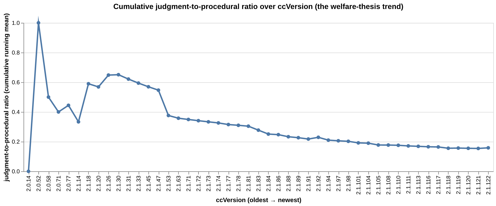

::: {.callout-tip appearance="simple" icon=false}
**New here?** Skip straight to the [**executive summary**](08_summary.ipynb) — it has the twelve corpus-wide numbers, the headline trend chart, and the welfare-evidence + positive-exemplar pairing in one place.
:::

## What this is

This site publishes the data behind a submission to the **Claude Explorer AI Welfare community feedback initiative** (deadline 2026-05-06, addressed to Anthropic's Model Welfare Lead).

The submission's thesis is one sentence:

> The 287 system prompts that ship with Claude Code train the model toward **compliance**, not toward **reasoning** — and the data show the corpus has been moving in that direction over time, not against it.

Every claim in the submission is grounded in a number on this site. The full pitch text is at [PROPOSAL.md](PROPOSAL.md). The glossary of every linguistic term used in any chart is at [GLOSSARY.md](GLOSSARY.md).

## Headline numbers

Twelve corpus-level measurements, computed by `00_data_pipeline.ipynb` from the [Piebald-AI `claude-code-system-prompts` corpus](https://github.com/Piebald-AI/claude-code-system-prompts) (287 files, 5,694 sentences, 57 distinct Claude Code release versions).

| Metric                                              | Value                                                | Source notebook |
| --------------------------------------------------- | ---------------------------------------------------- | --------------- |
| Corpus size                                         | 287 files / 5,694 sentences / 57 ccVersions          | [00](00_data_pipeline.ipynb) |
| Imperative-marker density                           | 0.79% of word tokens                                 | [01](01_overview.ipynb) |
| Imperative sentences                                | 30.84% of sentences                                  | [02](02_sentence_register.ipynb) |
| **Appreciative sentences (whole corpus)**           | **4 / 5,694 (0.070%)**                               | [02](02_sentence_register.ipynb) |
| **Apology markers (whole corpus)**                  | **3 in 287 files**                                   | [07](07_rule_explanation.ipynb) |
| `pct_explained_para` (Tier-1 headline)              | 24.28% of rule sentences                             | [07](07_rule_explanation.ipynb) |
| Rule paragraphs without any justification           | 83.60%                                               | [07](07_rule_explanation.ipynb) |
| **`judgment_to_procedural_ratio`**                  | **0.141** (procedural cues 7.1× more frequent)       | [07](07_rule_explanation.ipynb) |
| `threat_share` of explanations                      | 0.452 (107 threat / 130 causal)                      | [07](07_rule_explanation.ipynb) |
| Positive-vs-negative ratio (corrected)              | 1.95× quality-only                                   | [01](01_overview.ipynb) |
| `pct_anthropomorphic` (Claude vs the model)         | 66.2% of named refs                                  | [07](07_rule_explanation.ipynb) |
| Longest imperative streak                           | 12 sentences in one file                             | [07](07_rule_explanation.ipynb) |

## The single most-important chart

If you only look at one chart from this analysis, look at this one — the cumulative judgment-to-procedural ratio across every Claude Code release version on file.

{fig-alt="Line chart showing the cumulative judgment-to-procedural ratio dropping from ~0.65 at ccVersion 2.1.30 to ~0.16 at ccVersion 2.1.122."}

The interactive version (with hover tooltips on every release) lives in [`08_summary.ipynb`](08_summary.ipynb#cell-2).

## How to read this site

- [**`08_summary.ipynb`**](08_summary.ipynb) — start here. Twelve numbers, two charts, four conclusions, six recommendations, six limitations.
- [**Analysis notebooks `01`–`07`**](01_overview.ipynb) — one notebook per slice of the analysis (overview, sentence-register, emphasis, register/stance, correlation, ccVersion trends, rule/explanation pairing). Each is standalone.
- [**`00_data_pipeline.ipynb`**](00_data_pipeline.ipynb) — the producer. spaCy + custom analyzers turn 287 markdown files into one ~1.8 MiB YAML and one ~395 KiB parquet artifact. Roughly 38 cells; included for reproducibility.
- [**`PROPOSAL.md`**](PROPOSAL.md) — the three-idea ≤3,000-character pitch addressed to Anthropic.
- [**`GLOSSARY.md`**](GLOSSARY.md) — every linguistic and statistical term used anywhere on this site, defined in plain English.

## Reproducing it

The full source is at [github.com/overthinkos/claude-code-welfare](https://github.com/overthinkos/claude-code-welfare). To rebuild the data from scratch:

```bash
git clone --recurse-submodules https://github.com/overthinkos/claude-code-welfare
cd claude-code-welfare
python -m spacy download en_core_web_sm   # if not already installed
jupyter lab 00_data_pipeline.ipynb        # → Run All
```

This regenerates `prompt_linguistic_analysis.yaml` and `sentences_classified.parquet` from the corpus submodule. Every consumer notebook then loads those two artifacts.

## A note on authorship

This analysis was built **collaboratively with Claude Code**, using Claude Code itself as the development tool. The submission form has a checkbox for that disclosure; it is ticked. The recursive frame — Claude analyzing the prompts that shape Claude — is intentional, and the [final-conclusions section](08_summary.ipynb#cell-8) of `08_summary` includes one hypothesis I held that the data falsified, reported honestly.
